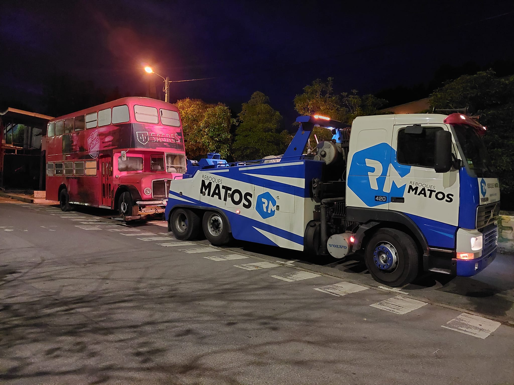

# PRD: Reboques Matos — Website v3 (Terminal Industries Edition)

---

## Overview

A premium, single-page marketing and lead-generation website for **Reboques Matos**, a roadside assistance, auto repair workshop, and towing service company based in **Aveiro, Portugal**. They operate **24 hours a day, 7 days a week**, offering flatbed tow trucks, vehicle recovery, on-site mechanical repair, and workshop services.

**The #1 design priority:** someone breaking down at 2am should be able to call within 3 seconds of landing on this page on mobile. Beyond that, it must build brand credibility for non-emergency bookings.

**Design DNA:** This website is a direct adaptation of [Terminal Industries](https://terminal-industries.com) — a Nuxt.js-powered corporate site with scroll-driven video sequences, GSAP character-by-character text reveals, numbered sticky-scroll feature sections, notch/curved SVG dividers, frosted-glass navigation, and full-bleed cinematic imagery. We take that premium visual language and apply the Reboques Matos brand on top of it.

**Offline reference:** A fully working local copy of Terminal Industries exists at `examples/terminal-industries.com/` with all CSS, videos, images, and fonts downloaded. Serve it with `python3 -m http.server 8889` from that directory to view the reference.

---

## Build Workflow for Orchestrator / Agent

This section tells an agent exactly how to produce the site from scratch.

### Project Structure

The project root is:
```
/Users/jcunhafonte/Projects/reboquesmatos/
```

The current v1 site lives at the root level (`index.html`, `styles.css`, `script.js`, `assets/`). **Do NOT modify those files.** Instead, create a new `v2/` folder for all output.

### Step-by-Step Build Instructions

#### Step 0 — Understand the reference
1. Read the Terminal Industries offline reference at `examples/terminal-industries.com/index.html` to understand the rendered HTML structure, section order, class naming conventions, and layout patterns.
2. Read the TI CSS files at `examples/terminal-industries.com/_nuxt/*.css` to understand the design tokens, grid system, typography scale, color variables, animation classes, and notch/divider implementations.
3. Do NOT copy TI's code verbatim — it's Nuxt/Vue-generated and full of framework-specific markup (`data-v-*`, `v-if`, hydration attributes). Instead, extract the **visual patterns** and **CSS techniques** and rewrite them as clean vanilla HTML/CSS.

#### Step 1 — Create output directory
```bash
mkdir -p /Users/jcunhafonte/Projects/reboquesmatos/v2/assets
```

#### Step 2 — Copy existing assets
Copy all real photos and the logo from the v1 `assets/` directory into `v2/assets/`. These are real company photos — do NOT replace them with placeholders.
```bash
cp /Users/jcunhafonte/Projects/reboquesmatos/assets/*.jpg /Users/jcunhafonte/Projects/reboquesmatos/v2/assets/
cp /Users/jcunhafonte/Projects/reboquesmatos/assets/*.svg /Users/jcunhafonte/Projects/reboquesmatos/v2/assets/
```

#### Step 3 — Build the site
Create these files inside `v2/`:
```
v2/
├── index.html      ← Single-page site (all sections hero to footer)
├── styles.css      ← Full design system + all section styles
├── script.js       ← All interactions (hero reveal, services scroll, counters, nav, form, etc.)
└── assets/
    ├── logo.svg            ← Copied from v1
    ├── night-tow.jpg       ← Copied from v1
    ├── flatbed-highway.jpg ← Copied from v1
    ├── fleet-headquarters.jpg ← Copied from v1
    ├── heavy-tow-rain.jpg  ← Copied from v1
    ├── highway-recovery.jpg← Copied from v1
    ├── bus-tow.jpg         ← Copied from v1
    └── hero-video.mp4      ← (Optional) If available
```

#### Step 4 — Reference the TI codebase during build
While writing `styles.css`, actively reference these TI CSS files for exact values:
- **Color system**: Search for `--c-dark-green`, `--c-lime`, `--c-white` in `_nuxt/*.css` — adapt to RM's color variables.
- **Typography**: Search for `font-family`, `SuisseIntl`, `GeistMono` — map to Inter and JetBrains Mono.
- **Grid system**: Search for `grid-template-columns`, `repeat(12` — replicate the 12-column approach.
- **Notch/dividers**: Search for `clip-path`, `notch`, `separator` — extract the SVG path data for curved dividers.
- **Animations**: Search for `transition`, `transform`, `opacity` patterns.
- **Backdrop blur**: Search for `backdrop-filter` — replicate the frosted-glass nav effect.

While writing `index.html`, reference `examples/terminal-industries.com/index.html` for:
- Section order and hierarchy.
- Class naming patterns (BEM-style).
- Semantic HTML structure (how they nest `<section>`, `<article>`, `<header>`, etc.).
- SVG divider markup between sections.

#### Step 5 — Verify
After building, serve the v2 site locally and verify:
```bash
cd /Users/jcunhafonte/Projects/reboquesmatos/v2 && python3 -m http.server 8890
```
Open `http://localhost:8890/` and confirm:
- Hero scroll-driven text reveal works.
- Nav frosted glass effect transitions on scroll.
- Services section sticky-scroll works on desktop.
- All images load correctly from `assets/`.
- Phone links are tap-to-call.
- Form submits to Formspree.
- Mobile menu works.
- WhatsApp FAB appears after delay.
- Emergency strip visible on mobile, hides when footer visible.

### What NOT to Do
- **Do NOT modify any files in the root** (`index.html`, `styles.css`, `script.js`) — those are v1.
- **Do NOT modify anything in `examples/`** — that's the reference, not the output.
- **Do NOT use Nuxt, Vue, React, or any framework** — output is vanilla HTML/CSS/JS.
- **Do NOT use GSAP or ScrollTrigger** — use vanilla JS with `IntersectionObserver` and `scroll` events.
- **Do NOT create a `node_modules/` or `package.json`** — no build step needed.
- **Do NOT use placeholder images** — all photos in `assets/` are real company photos.
- **Do NOT invent new content** — all PT-PT copy is specified in the Content section below.

---

## Primary Design Reference: Terminal Industries

### Source Analysis (from offline copy)

The Terminal Industries site uses:
- **32 CSS files** (Nuxt-generated) with a comprehensive design system
- **12 local MP4 videos** for scroll-driven sequences and section backgrounds
- **2 font families**: SuisseIntl (headings/body) and GeistMono (monospace accents)
- **GSAP ScrollTrigger** for scroll-driven animations and character-by-character text reveals
- **Canvas-based video frame rendering** in the hero (we simplify this to `<video>` elements)
- **12-column CSS grid** layout system with fluid responsive breakpoints
- **Notch/curved SVG dividers** between sections creating organic transitions
- **BackgroundCanvas** component for animated dot grid patterns

### What We Replicate Exactly

| Terminal Industries Pattern | Reboques Matos Adaptation |
|---|---|
| Scroll-driven hero video sequence with character-by-character text reveal | Video background hero with scroll-driven text reveal using electric blue accent instead of lime green |
| Frosted-glass floating nav pill with `backdrop-filter: blur()` | Same pattern, add phone number CTA to nav |
| Numbered sticky-scroll features section (01, 02, 03...) with SVG-masked crossfading images | Same layout for 6 services, wave clip-path on images |
| Notch/curved SVG section dividers (concave cuts between sections) | Same SVG dividers with adapted fill colors |
| Dark teal (`#052424`) sections alternating with white | Same palette, `#052424` as primary dark |
| Lime green accent (`#ABFF02`) for numbers, indicators, active states | Electric blue accent (`#1A6FD4`) |
| Subtle dot grid background on both dark and light sections | Same pattern via CSS radial-gradient |
| SuisseIntl typography — clean geometric sans-serif | Inter (Google Fonts, free equivalent) |
| GeistMono for data/labels | JetBrains Mono (Google Fonts, free equivalent) |
| Large cinematic type: ~87px, weight 400, tight letter-spacing | Same sizing and weight via `clamp()` |
| Full-bleed cinematic imagery with dark overlays | Same pattern with RM fleet/workshop photos |
| 12-column grid layout | Same grid, simplified without Nuxt framework |

### What We Simplify

| Terminal Industries (Complex) | Reboques Matos (Simplified) |
|---|---|
| Canvas-based frame-by-frame video rendering via GSAP | `<video>` element with `autoplay muted loop` |
| GSAP ScrollTrigger library (~60KB) | Vanilla JS `IntersectionObserver` + `scroll` events |
| Nuxt.js SPA framework with Storyblok CMS | Static HTML + CSS + vanilla JS (no build step) |
| Multiple video format sources per section | Single optimized MP4 per section, photos as fallback |
| Vue.js reactive components | Plain DOM manipulation |
| Storyblok dynamic content | Hardcoded PT-PT content |

---

## Brand Reality

| Field | Value |
|---|---|
| **Business Name** | Reboques Matos |
| **Address** | Rua do Castanheiro, 27, Aveiro, Portugal, 3810-739 |
| **Phone** | 234 941 680 |
| **Hours** | Sempre aberto — 24 Horas |
| **Category** | Serviço de guincho · Oficina de reparação de automóveis · Pronto socorro |
| **Logo** | Blue hexagon with white "RM" monogram |
| **Brand colors** | Dark steel grey facade + electric blue accents |
| **Fleet** | White tow trucks with "REBOQUES MATOS" livery, blue flatbed trailer |
| **Workshop** | Dark corrugated steel facade, large garage doors |
| **Facebook** | https://www.facebook.com/reboquesmatos |

### Services Confirmed
1. **Serviço de Guincho** — flatbed platform for all vehicle types
2. **Pronto Socorro** — roadside emergency assistance
3. **Oficina de Reparação de Automóveis** — on-site auto repair workshop
4. **Assistência 24 Horas** — no exceptions, always available
5. **Veículos Pesados** — heavy vehicle transport up to 3500kg
6. **Cobertura Regional** — Aveiro, Ílhavo, Vagos, Águeda, Oliveira do Bairro and wider region

---

## Target Users

| User | Situation | Primary Need |
|---|---|---|
| Stranded driver | Emergency on the road at any hour | Phone number visible in < 3 seconds |
| Fleet manager | Multiple company vehicles, needs a reliable partner | Track record, 24h guarantee, professional tone |
| Private car owner | Non-urgent repair or maintenance | Services listed clearly, location easy to find |
| Heavy vehicle operator | HGV breakdown, needs flatbed capacity | Specific capability proof points |
| Insurance provider | Contracted roadside assistance partner | Credibility, coverage, professionalism |

---

## Design System

### Color Palette

```css
:root {
  /* Core — directly from Terminal Industries, adapted */
  --color-bg:              #FFFFFF;
  --color-dark:            #052424;          /* TI: --c-dark-green. Hero, CTA, footer */
  --color-dark-lighter:    #0A3636;          /* Hover states on dark bg */
  --color-text:            #052424;          /* Primary text on light */
  --color-text-light:      #FFFFFF;          /* Text on dark */
  --color-muted:           rgba(5,36,36,0.5); /* Muted text on light */
  --color-muted-dark:      rgba(204,204,204,0.6); /* Muted text on dark */

  /* Accent — replaces TI's --c-lime: #ABFF02 */
  --color-accent:          #1A6FD4;          /* Electric blue — RM brand */
  --color-accent-light:    #3B8EEA;          /* Hover state */
  --color-accent-glow:     rgba(26,111,212,0.25);

  /* Grid pattern — from TI's BackgroundCanvas approach */
  --grid-line-light:       rgba(204,204,204,0.27);
  --grid-line-dark:        rgba(204,204,204,0.12);
  --grid-dot-accent:       #1A6FD4;

  /* Surfaces */
  --color-surface:         #F8F9FA;
  --color-border:          #E5E7EB;

  /* Utility */
  --color-whatsapp:        #25D366;
  --color-emergency:       #1A6FD4;
  --color-star:            #F5A623;
}
```

### Typography

```css
/* Maps to TI's SuisseIntl → Inter (free Google Font equivalent) */
/* Maps to TI's GeistMono → JetBrains Mono (free Google Font equivalent) */

:root {
  --font-primary: 'Inter', system-ui, -apple-system, sans-serif;
  --font-mono: 'JetBrains Mono', 'Fira Code', monospace;
}
```

**Type Scale (matching Terminal Industries hierarchy):**

| Element | Size | Weight | Letter-spacing | Line-height | Notes |
|---|---|---|---|---|---|
| Hero scroll text | `clamp(3rem, 8vw, 6rem)` | 400 | -2px | 0.95 | Character-by-character reveal with accent color |
| Statement H1 | `clamp(3rem, 7vw, 5.5rem)` | 400 | -1.5px | 0.95 | TI uses ~87px at this level |
| Section H2 | `clamp(2rem, 4vw, 3.5rem)` | 400 | -1px | 1.1 | ~60-70px equivalent |
| Brand massive | `clamp(8rem, 20vw, 16rem)` | 700 | -4px | 0.85 | TI's "YOS™" treatment |
| Feature headline | `clamp(1.5rem, 3vw, 2.25rem)` | 400 | -0.5px | 1.2 | Active: opacity 1, inactive: 0.25 |
| Benefit headline | 28-32px | 600 | -0.3px | 1.2 | |
| Body text | 16px | 400 | 0 | 1.6 | |
| Section label | 12px | 500 | 2-3px | 1 | Uppercase, mono font |
| Numbers (01, 02) | 14px | 500 | 1px | 1 | Mono font, accent color |
| Nav links | 14-15px | 400 | 1px | 1 | |
| CTA button text | 13px | 500 | 2.5px | 1 | Uppercase |

### Spacing System

```
Section vertical padding:     10rem desktop / 5rem mobile
Content max-width:            1200px, centered
Nav max-width:                900px, centered
Horizontal padding:           2rem (desktop) / 1.25rem (mobile)
Grid cell size:               120px × 120px (background pattern)
Card gap:                     2rem
Card padding:                 2.5rem
Card border-radius:           16px
Button border-radius:         50px (pill)
Feature item spacing:         80px vertical between items
```

### Breakpoints

```
375px   — mobile S (iPhone SE)
390px   — mobile M (iPhone 14)
768px   — tablet (hide mobile-only elements, collapse mobile menu)
1024px  — desktop S (enable sticky scroll services)
1280px  — desktop M
1440px  — desktop L
```

---

## Site Architecture

**Single-page application** (`index.html`) — all content lives on one scrolling page. No multi-page navigation needed. Internal nav links scroll to anchored sections.

```
#hero              → Full-viewport scroll-driven video hero with text reveal
#statement         → Bold mission/value statement on dark background
#services          → Numbered sticky-scroll service showcase (signature section)
#brand             → Brand statement moment ("24H")
#benefits          → 3 benefit cards with full-bleed images
#testimonials      → Full-bleed dark image quote
#trust             → Stats counter + partner logo bar
#how-it-works      → 3-step process cards
#contact           → Contact form + contact options + Google Maps embed
#cta               → Final CTA banner
#footer            → Footer with links, address, social
```

---

## Section-by-Section Specification

---

### 1. Navigation (Global, Sticky)

**Pattern: Terminal Industries floating nav pill — frosted glass with `backdrop-filter`**

The TI nav is a centered pill-shaped bar floating over the hero, transitioning from transparent to frosted glass on scroll. It uses `backdrop-filter: blur(12px)` with semi-transparent dark background.

```
┌──────────────────────────────────────────────────────────────┐
│  [RM Logo]    Serviços  Sobre  Contacto     📞 234 941 680  │
│               ↓anchor   ↓anchor  ↓anchor     [LIGAR AGORA]  │
└──────────────────────────────────────────────────────────────┘
```

**Implementation details:**
- **Position**: `position: fixed`, centered horizontally, `top: 20px`, `z-index: 1000`.
- **Shape**: `border-radius: 50px`, `padding: 12px 32px`.
- **Background**: `rgba(5, 36, 36, 0.6)` + `backdrop-filter: blur(16px)` + `-webkit-backdrop-filter: blur(16px)`.
- **Width**: `max-width: 900px`, `margin: 0 auto`.
- **Logo**: RM hexagon SVG (32px) + "Reboques Matos" wordmark in white. Wordmark hidden below 900px.
- **Links**: White, 14px, weight 400, `letter-spacing: 1px`. No underlines. Hover: `opacity: 0.7`.
- **CTA button (right)**: White background, dark text, `border-radius: 24px`, `padding: 8px 20px`, uppercase, `letter-spacing: 2px`, `font-size: 12px`. Contains phone icon + number. Links to `tel:234941680`.
- **Scroll transition**: On scroll > 50px, add class `.nav--scrolled` — background opacity increases to `0.85`, adds `box-shadow: 0 4px 30px rgba(0,0,0,0.1)`.
- **Mobile (< 768px)**: Hamburger icon (3 animated bars, white, 24px) replaces nav links. Tap opens full-screen overlay drawer with nav links centered vertically (28px, `line-height: 3`). Close on clicking a link or clicking outside. Phone CTA remains visible in the nav bar on mobile.

**CSS class structure:**
```
.nav                    — the pill container
.nav--scrolled          — added on scroll > 50px
.nav__logo              — logo wrapper
.nav__logo-text         — "Reboques Matos" wordmark
.nav__links             — desktop nav links container
.nav__cta               — phone CTA button
.nav__hamburger         — mobile hamburger button
.nav__hamburger.is-active — hamburger open state (X shape)
.nav__drawer            — mobile overlay menu
.nav__drawer.is-open    — drawer visible
.nav__drawer-cta        — "Ligar Agora" in drawer
```

---

### 2. Hero Section (`#hero`)

**Pattern: Terminal Industries scroll-driven video hero with character-by-character text reveal**

This is the signature TI interaction. The hero occupies the full viewport with a looping video background. As the user scrolls, large text is revealed character-by-character, with each newly-revealed character highlighted in the accent color before fading to white. When scrolled past the hero, the text disappears.

**TI's implementation (what we saw working):**
- Full-viewport container with `min-height: 300vh` to create enough scroll distance
- Fixed-position video background covering the viewport
- 3-4 title sequences shown one at a time based on scroll position
- Each title has individual `<span class="--char">` elements for per-character animation
- Characters go from `opacity: 0` → accent color → white as scroll progresses
- A scroll indicator text at the bottom ("scroll to explore") that fades out on scroll

**Our implementation (simplified, no GSAP):**

```html
<section id="hero" class="hero">
  <!-- Video background — fixed position, covers viewport -->
  <div class="hero__video-wrap">
    <video class="hero__video" autoplay muted loop playsinline>
      <source src="assets/hero-video.mp4" type="video/mp4">
    </video>
    <!-- Fallback for no-video: show hero image -->
    
  </div>

  <!-- Dark gradient overlay at bottom for readability -->
  <div class="hero__overlay"></div>

  <!-- Scroll-driven text reveal — fixed at bottom of viewport -->
  <div class="hero__scroll-content">
    <div class="hero__title" data-title="0">
      <!-- Each character is a <span class="hero__char"> -->
      Avariado na estrada?
    </div>
    <div class="hero__title" data-title="1">
      Estamos a caminho.
    </div>
    <div class="hero__title" data-title="2">
      24 Horas. Todos os dias.
    </div>
    <div class="hero__title" data-title="3">
      Reboques Matos.
    </div>
  </div>

  <!-- Scroll indicator -->
  <div class="hero__scroll-indicator">
    <span>Desça para explorar</span>
    <i data-lucide="chevron-down"></i>
  </div>
</section>
```

**CSS requirements:**

```css
.hero {
  position: relative;
  min-height: 300vh;       /* Creates scroll distance for the text reveal */
}

.hero__video-wrap {
  position: fixed;
  top: 0; left: 0;
  width: 100vw; height: 100vh;
  z-index: 0;
  overflow: hidden;
}

.hero__video {
  width: 100%; height: 100%;
  object-fit: cover;
}

.hero__video-fallback {
  display: none;            /* Shown via JS if video fails */
  width: 100%; height: 100%;
  object-fit: cover;
}

.hero__overlay {
  position: fixed;
  bottom: 0; left: 0; right: 0;
  height: 40vh;
  background: linear-gradient(to bottom, transparent, rgba(0,0,0,0.5));
  z-index: 1;
  pointer-events: none;
}

.hero__scroll-content {
  position: fixed;
  bottom: 10vh;
  left: 0; right: 0;
  z-index: 10;
  pointer-events: none;
  text-align: center;
}

.hero__title {
  font-family: var(--font-primary);
  font-size: clamp(3rem, 8vw, 6rem);
  font-weight: 400;
  letter-spacing: -2px;
  line-height: 0.95;
  color: white;
  position: absolute;
  bottom: 0; left: 0; right: 0;
  display: none;             /* JS shows active title */
  padding: 0 2rem;
}

.hero__title.is-active {
  display: block;
}

.hero__char {
  opacity: 0;
  transition: none;          /* JS controls reveal */
}

.hero__char.is-revealed {
  opacity: 1;
  color: white;
}

.hero__char.is-active {      /* Currently-revealing character */
  color: var(--color-accent); /* Electric blue flash */
  opacity: 1;
}

.hero__scroll-indicator {
  position: fixed;
  bottom: 3vh;
  left: 50%;
  transform: translateX(-50%);
  z-index: 10;
  text-align: center;
  color: white;
  opacity: 0.7;
  font-size: 11px;
  text-transform: uppercase;
  letter-spacing: 3px;
  transition: opacity 0.3s ease;
}

/* Hide scroll indicator after scrolling begins */
.hero__scroll-indicator.is-hidden {
  opacity: 0;
}
```

**JavaScript requirements (scroll-driven text reveal):**

```javascript
function initHeroScrollReveal() {
  const hero = document.querySelector('.hero');
  if (!hero) return;

  const scrollContent = hero.querySelector('.hero__scroll-content');
  const titles = hero.querySelectorAll('.hero__title');
  const scrollIndicator = hero.querySelector('.hero__scroll-indicator');

  // Split each title text into individual <span class="hero__char"> elements
  titles.forEach(title => {
    const text = title.textContent;
    title.innerHTML = '';
    for (const char of text) {
      const span = document.createElement('span');
      span.className = 'hero__char';
      span.textContent = char === ' ' ? '\u00A0' : char;
      title.appendChild(span);
    }
  });

  // Scroll handler
  const onScroll = () => {
    const heroRect = hero.getBoundingClientRect();
    const totalScroll = hero.offsetHeight - window.innerHeight;
    const scrolled = -heroRect.top;

    // Hide everything when scrolled past hero
    if (scrolled > totalScroll) {
      scrollContent.style.display = 'none';
      return;
    }
    scrollContent.style.display = '';

    // Hide scroll indicator after 50px of scroll
    if (scrollIndicator) {
      scrollIndicator.classList.toggle('is-hidden', scrolled > 50);
    }

    const progress = Math.max(0, Math.min(1, scrolled / totalScroll));

    // Map progress to active title
    const titleCount = titles.length;
    const activeTitleIndex = Math.min(
      titleCount - 1,
      Math.floor(progress * titleCount)
    );

    // Show only active title
    titles.forEach((title, i) => {
      title.classList.toggle('is-active', i === activeTitleIndex);
    });

    // Character reveal within active title
    const activeTitle = titles[activeTitleIndex];
    const chars = activeTitle.querySelectorAll('.hero__char');
    const titleProgress = (progress * titleCount) - activeTitleIndex;
    const revealCount = Math.floor(titleProgress * chars.length);

    chars.forEach((char, i) => {
      char.classList.remove('is-revealed', 'is-active');
      if (i < revealCount) {
        char.classList.add('is-revealed');
      } else if (i === revealCount) {
        char.classList.add('is-active'); // Accent-colored current char
      }
    });
  };

  window.addEventListener('scroll', onScroll, { passive: true });
  onScroll();
}
```

**Video content guidance:**
- Ideal: A 10-15 second looping MP4 of the RM tow truck driving at night or loading a vehicle. Dark-toned, cinematic.
- If no video available: Use `assets/night-tow.jpg` as a static fallback with subtle CSS parallax (`background-attachment: fixed` or `transform: translateY()` on scroll).
- File: `assets/hero-video.mp4` (target < 5MB for mobile performance).
- If no hero video exists, fall back to the static image approach from the current site (full-viewport `` with overlay).

**Mobile considerations:**
- On mobile, reduce `min-height` to `200vh` (less scroll distance needed for thumbs).
- Font size scales down via `clamp()`.
- Video may be replaced with static image on very slow connections (detect via `navigator.connection` API).

---

### 3. Statement Section (`#statement`)

**Pattern: Terminal Industries massive headline on dark background with grid pattern**

TI places a large centered statement on `#052424` dark background after the hero. Two-line headline structure with hierarchy.

- **Background**: `var(--color-dark)` (`#052424`) with dot grid pattern overlay.
- **Padding**: `160px 0` desktop, `80px 0` mobile.
- **Content centered**, `max-width: 1000px`.

```
[small label]     ASSISTÊNCIA RODOVIÁRIA · AVEIRO
[H1 line 1]       Avariado na estrada?
[H1 line 2]       Estamos a caminho.
[subheadline]     Guincho profissional, pronto socorro e oficina — 24 horas, todos os dias.
[CTA row]         [📞 Ligar Agora — 234 941 680]   [💬 WhatsApp]
```

- **Label**: 12px, uppercase, `letter-spacing: 3px`, muted light color, `font-family: var(--font-mono)`.
- **H1**: `clamp(3rem, 7vw, 5.5rem)`, weight 400, `letter-spacing: -1.5px`, `line-height: 0.95`, white. Line 2 has accent-color span on "a caminho".
- **Subheadline**: 18px, weight 400, muted light color, `line-height: 1.6`, `margin-top: 24px`.
- **CTA row**: `margin-top: 40px`, `display: flex`, `gap: 16px`, `flex-wrap: wrap`, `justify-content: center`.
  - Primary CTA: Electric blue bg (`#1A6FD4`), white text, `border-radius: 50px`, `padding: 14px 32px`, `font-size: 14px`, uppercase, `letter-spacing: 2px`. `<a href="tel:234941680">`.
  - Secondary CTA: WhatsApp green bg (`#25D366`), white text, same shape. `<a href="https://wa.me/351234941680">`.
- **Animation**: H1 fades in (opacity 0→1, translateY 40px→0) on scroll into view, 0.8s ease-out via IntersectionObserver.

---

### 4. Divider System

**Pattern: Terminal Industries notch/curved SVG section dividers**

TI uses concave curves between sections that create smooth organic transitions. Implement as inline SVG elements positioned between sections.

```html
<!-- Dark → Light transition -->
<div class="divider">
  <svg viewBox="0 0 1440 80" preserveAspectRatio="none" xmlns="http://www.w3.org/2000/svg">
    <path d="M0,0 C480,80 960,80 1440,0 L1440,80 L0,80 Z" fill="#FFFFFF"/>
  </svg>
</div>

<!-- Light → Dark transition -->
<div class="divider">
  <svg viewBox="0 0 1440 80" preserveAspectRatio="none" xmlns="http://www.w3.org/2000/svg">
    <path d="M0,0 C480,80 960,80 1440,0 L1440,80 L0,80 Z" fill="#052424"/>
  </svg>
</div>
```

**Important:** SVG `fill` must use literal hex colors, NOT CSS variables. `fill="var(--color)"` does not work in SVG attributes.

```css
.divider {
  margin-top: -1px;        /* Prevent subpixel gaps */
  line-height: 0;
  overflow: hidden;
}
.divider svg {
  width: 100%;
  height: 60px;
  display: block;
}
```

---

### 5. Numbered Services Scroll (`#services`)

**Pattern: Terminal Industries sticky numbered feature scroll — THE SIGNATURE SECTION**

TI's "Features" section is a sticky-scroll layout: left text column is position-sticky, right image crossfades. Items have numbered labels (01, 02, 03...) in accent color. Active item is full opacity; others are faded to ~25%.

**Layout**: 2-column, `gap: 0`. Left column ~45% width, right column ~55% width.

**Desktop behavior (> 1024px):**
- Section has `min-height: 350vh` to create scroll distance.
- Left column: `position: sticky`, `top: 50%`, `transform: translateY(-50%)`.
- As user scrolls through the section, the active service item changes based on scroll position.
- Active item: `opacity: 1`, description visible.
- Inactive items: `opacity: 0.25`, description hidden.
- Right column: Images stacked absolutely, crossfade via `opacity` transitions.

**Mobile behavior (≤ 1024px):**
- All items visible (no scroll-driven behavior).
- Single image shown (first service image).
- Each item is clickable to switch the displayed image.

**Left column item structure:**
```html
<div class="services__item is-active" data-index="0">
  <div class="services__item-number">
    <span class="services__item-bar"></span>   <!-- 3px wide, 24px tall, accent color -->
    <span class="services__item-num">01</span> <!-- Mono font, accent color, 14px -->
  </div>
  <h3 class="services__item-title">Serviço de Guincho</h3>
  <p class="services__item-desc">Transporte seguro de veículos...</p>
</div>
```

**Right column image structure:**
```html
<div class="services__image-wrap">
  
  
  <!-- etc. -->
</div>
```

**Image styling — wave clip-path (matching TI's SVG-masked images):**
```css
.services__image-wrap img {
  position: absolute;
  inset: 0;
  width: 100%;
  height: 100%;
  object-fit: cover;
  opacity: 0;
  transition: opacity 0.6s ease;
  clip-path: url(#wave-clip);     /* Or use CSS clip-path with polygon/ellipse */
  border-radius: 0 24px 24px 0;
}
.services__image-wrap img.is-active {
  opacity: 1;
}
```

**CSS clip-path alternative (no SVG `<clipPath>` needed):**
```css
clip-path: ellipse(95% 50% at 60% 50%);
```

**Services data:**

| # | Title | Description | Image |
|---|---|---|---|
| 01 | Serviço de Guincho | Transporte seguro de veículos ligeiros e pesados em plataforma flatbed. Cobrimos Aveiro e toda a região. | `assets/flatbed-highway.jpg` |
| 02 | Pronto Socorro | Avaria na estrada? A nossa equipa chega até si com equipamento de diagnóstico e reparação no local. | `assets/heavy-tow-rain.jpg` |
| 03 | Oficina de Reparação | Diagnóstico, manutenção e reparação de automóveis em instalações próprias com equipamento profissional. | `assets/fleet-headquarters.jpg` |
| 04 | Assistência 24 Horas | Dia ou noite, fim de semana ou feriado. Nunca fechamos. Nunca. | `assets/night-tow.jpg` |
| 05 | Veículos Pesados | Capacidade para transporte de veículos pesados até 3500kg em plataforma especializada. | `assets/bus-tow.jpg` |
| 06 | Cobertura Regional | Aveiro, Ílhavo, Vagos, Águeda, Oliveira do Bairro e toda a região centro. | `assets/highway-recovery.jpg` |

**JavaScript (scroll-driven active state):**
```javascript
function initServicesScroll() {
  const section = document.querySelector('.services');
  if (!section) return;

  const items = section.querySelectorAll('.services__item');
  const images = section.querySelectorAll('.services__image-wrap img');
  if (!items.length || !images.length) return;

  const isDesktop = () => window.innerWidth > 1024;

  const setActive = (index) => {
    items.forEach((item, i) => item.classList.toggle('is-active', i === index));
    images.forEach((img, i) => img.classList.toggle('is-active', i === index));
  };

  // Click handler for mobile/manual
  items.forEach(item => {
    item.addEventListener('click', () => {
      setActive(parseInt(item.dataset.index, 10));
    });
  });

  // Scroll-driven (desktop only)
  const onScroll = () => {
    if (!isDesktop()) return;
    const rect = section.getBoundingClientRect();
    const layoutOffsetPx = 280;
    const scrollableDistance = rect.height - window.innerHeight - layoutOffsetPx;
    const scrolled = -(rect.top) - layoutOffsetPx;
    const progress = Math.max(0, Math.min(1, scrolled / Math.max(scrollableDistance, 1)));
    const activeIndex = Math.min(items.length - 1, Math.floor(progress * items.length));
    setActive(activeIndex);
  };

  window.addEventListener('scroll', onScroll, { passive: true });
  onScroll();
}
```

---

### 6. Brand Statement Section (`#brand`)

**Pattern: Terminal Industries "YOS™" brand moment — massive centered type on dark background**

- **Dark teal background** (`#052424`) with grid pattern.
- **Curved SVG divider** at top (dark-to-light transition before this, light-to-dark after).
- **Padding**: `200px 0` desktop, `120px 0` mobile.
- **Content centered:**
  ```
  [small text]    Confiança medida em quilómetros.
  [MASSIVE text]  24H
  ```
- Small text: 18px, `rgba(255,255,255,0.6)`, weight 400.
- **"24H"**: `clamp(8rem, 20vw, 16rem)`, weight 700, white, `letter-spacing: -4px`. This is the single most important brand differentiator.
- **Animation**: Both lines fade in on scroll (IntersectionObserver).

---

### 7. Benefits Section (`#benefits`)

**Pattern: Terminal Industries benefit cards with full-bleed images and 2-column text**

- **White background**.
- **Section header**: Label `PORQUÊ A REBOQUES MATOS` + H2 `O que nos distingue.`
- **3 benefit articles**, each containing:
  - Full-width image at top (`border-radius: 16px`, 16:9 ratio, `loading="lazy"`).
  - Below image: 2-column text layout (editorial style).
    - **Left**: Label (e.g., `Benefício 01` — muted, small) + **bold headline** (~28px, weight 600).
    - **Right**: Body text (~16px, muted, `line-height: 1.7`).

**Benefits:**

| # | Title | Description | Image |
|---|---|---|---|
| 01 | Rapidez | Resposta imediata a qualquer hora. Equipa sempre pronta, guincho sempre disponível. Do telefonema à chegada, no menor tempo possível. | `assets/highway-recovery.jpg` |
| 02 | Fiabilidade | Equipamento profissional, técnicos experientes, resultados comprovados em milhares de assistências. Pode confiar em nós. | `assets/heavy-tow-rain.jpg` |
| 03 | Proximidade | Conhecemos cada estrada de Aveiro e região. Somos os vizinhos em quem pode confiar. Sempre perto, sempre disponíveis. | `assets/fleet-headquarters.jpg` |

---

### 8. Testimonials Section (`#testimonials`)

**Pattern: Terminal Industries full-bleed dark image quote**

- **Full-bleed background image**: `assets/flatbed-highway.jpg` — dark-toned, cinematic.
- **Dark overlay**: `rgba(5, 36, 36, 0.75)`.
- **Content centered**, `max-width: 800px`.
- **Stars**: 5 yellow stars above the quote, `color: var(--color-star)`.
- **Quote**: `"Liguei às 3 da manhã com o carro avariado na A25. Em menos de 40 minutos estavam lá. Profissionais de verdade."` — white, italic feel, ~28px, `line-height: 1.5`.
- **Attribution**: `<strong>Manuel S.</strong> · Aveiro · Assistência noturna na A25` — 16px, white.
- **Animation**: Fade in on scroll.

---

### 9. Trust Bar Section (`#trust`)

**Pattern: Terminal Industries logo grid + animated number counters**

- **White background** with grid dot pattern.
- **Section header**: Label `CONFIANÇA COMPROVADA` + H2 `Ao serviço de Aveiro há mais de 20 anos.`
- **Stats row** (animated count-up on scroll into view):

| Number | Suffix | Label |
|---|---|---|
| 24 | H | Sempre abertos |
| 365 | | Dias por ano |
| 80 | km | Raio de cobertura |
| 1000 | + | Assistências/ano |

- Numbers: Mono font, accent color, ~48px, weight 700.
- Labels: 14px, muted, uppercase.
- Counter animation: Count from 0 to target value over 2 seconds, eased (cubic), triggered by IntersectionObserver.
- Numbers formatted with PT-PT locale (`toLocaleString('pt-PT')`).

- **Separator line** below stats.
- **Partner logos row**: 5 placeholder items (insurance company names as text until real logos are provided): Fidelidade, Allianz, Tranquilidade, Ageas, Liberty. Grid with vertical dividers between logos.

---

### 10. How It Works Section (`#how-it-works`)

**Pattern: 3-step process cards (adapted from Terminal Industries + simplified)**

- **White background**.
- **Section header**: Label `COMO FUNCIONA` + H2 `Do telefonema à solução, em 3 passos.`
- **3 cards** in horizontal row (desktop) / vertical stack (mobile):

| # | Title | Description |
|---|---|---|
| 01 | Ligue para nós | Um operador atende de imediato, 24h por dia. Descreva a sua situação e localização. |
| 02 | Enviamos ajuda | Guincho ou técnico a caminho para a sua localização. Acompanhamento em tempo real. |
| 03 | Problema resolvido | Na estrada ou na nossa oficina, cuidamos de tudo. O seu veículo em boas mãos. |

- **Card styling**: `background: var(--color-surface)`, `border-radius: 16px`, `padding: 40px`.
- **Number**: Mono font, accent color, 14px, with accent-colored left-border bar (3px × 24px).
- **Step title**: 24px, weight 600.
- **Step description**: 16px, muted.
- **Staggered animation**: Each card fades in with 150ms delay offset.

---

### 11. Contact Section (`#contact`)

**Pattern: Terminal Industries 2-column contact layout with underline-style form inputs**

- **White background**.
- **H2**: `Contacte-nos` — massive, centered, ~80px, weight 400.
- **Subheadline**: `Fale connosco, nos seus termos:` — 18px, muted.

**2-column layout:**

**Left column — Contact options list:**
```
01  📞  Ligar agora — 234 941 680        → tel:234941680
02  💬  Enviar WhatsApp                   → wa.me/351234941680
03  📍  Visitar a oficina                 → Google Maps link
04  📧  Enviar mensagem                   → scrolls to form
```
Each item has accent-colored left-border bar + mono number + icon + text. Items are clickable links.

**Right column — Contact form:**
- **Title**: `Deixe-nos os seus dados:` — 28px.
- **Fields** (underline style):
  - `border: none; border-bottom: 1px solid var(--color-border); background: transparent; padding: 12px 0; font-size: 16px; width: 100%;`
  - Focus state: `border-bottom-color: var(--color-accent); outline: none;`
  - Error state: `border-bottom-color: #E53E3E;` + inline error text in red, 13px.
  - Placeholder text: muted color, disappears on focus.

**Form fields:**
1. Nome completo * (`required`, `type="text"`)
2. Telefone * (`required`, `type="tel"`)
3. Email (`type="email"`)
4. Assunto (`<select>`): Serviço de Guincho / Pronto Socorro / Oficina / Orçamento / Outro
5. Mensagem (`<textarea>`)

**Submit button**: Full-width, `background: var(--color-surface)`, dark text, uppercase, `letter-spacing: 2px`, `padding: 16px`, `border-radius: 8px`. Hover: `background: var(--color-accent); color: white;`.

**Form submission**: POST to Formspree endpoint (`https://formspree.io/f/xpwzgkdl`).

**Client-side validation:**
- Required fields checked on blur and submit.
- Email format validation: `/^[^\s@]+@[^\s@]+\.[^\s@]{2,}$/`.
- Phone format validation: `/^[\d\s+\-()]{7,20}$/`.
- Textarea minimum 10 characters.
- On submit failure: prevent default, focus first invalid field.
- On submit: disable button, show "A enviar..." text.

**Google Maps embed** below the form:
```html
<iframe
  src="https://www.google.com/maps/embed?pb=!1m18!1m12!1m3!1d3024.2!2d-8.6538!3d40.6405!..."
  title="Localização Reboques Matos"
  loading="lazy"
  style="width:100%; height:400px; border:none; border-radius:16px;"
></iframe>
```
Caption: `Cobrimos Aveiro e toda a região. Em caso de dúvida, ligue — chegamos.`

---

### 12. Final CTA Banner (`#cta`)

**Pattern: Terminal Industries closing CTA — dark teal + grid pattern**

- **Dark teal background** (`#052424`) with grid pattern.
- **Curved SVG divider** at top.
- **Content centered**, `padding: 120px 0`.
- **H2**: `Não espere. Ligue agora.` — white, italic, `clamp(2.5rem, 5vw, 4rem)`.
- **Two CTA buttons** below, side by side:
  - `📞 234 941 680` — white bg, dark text, pill shape.
  - `💬 WhatsApp` — green bg, white text, pill shape.

---

### 13. Footer

**Pattern: Terminal Industries 4-column dark footer with grid pattern**

- **Dark teal background** (`#052424`), continuous from CTA.
- **Grid pattern** continues.
- **4-column layout** (desktop), single column stack (mobile):
  - **Col 1**: RM logo (SVG, 40px) + "Reboques Matos" wordmark + "Assistência 24H" badge + address.
  - **Col 2**: `SERVIÇOS` (uppercase label) → Guincho, Pronto Socorro, Oficina, 24 Horas (links to #services).
  - **Col 3**: `EMPRESA` (uppercase label) → Sobre Nós (#benefits), Contacto (#contact).
  - **Col 4**: `CONTACTO` → Phone number (accent color, monospace, clickable), WhatsApp link, address, Facebook icon.
- **Bottom bar**: `© 2025 Reboques Matos. Todos os direitos reservados.` — muted, small, centered.

---

## Floating Global Elements

### WhatsApp FAB
- `position: fixed`, `bottom: 24px`, `right: 24px`, all screen sizes.
- WhatsApp green (`#25D366`) circle, `width: 56px`, `height: 56px`, white message icon inside.
- `box-shadow: 0 4px 16px rgba(37, 211, 102, 0.4)`.
- Hover: Expands to show label "Falar connosco" — pill shape, same green bg.
- `z-index: 9998`.
- Link: `https://wa.me/351234941680`.
- Appears after 1.5s delay with scale animation.

### Emergency Phone Strip (mobile only)
- `position: fixed`, `bottom: 0`, `width: 100%`, `z-index: 9999`.
- `background: var(--color-accent)` (electric blue).
- `<a href="tel:234941680">` covering full bar.
- Content: `🚨 Avaria? Ligue já: 234 941 680` — white, bold, centered, 16px.
- `padding: 14px 0`.
- Hidden on desktop (`display: none` above 768px).
- Hides when footer is visible (IntersectionObserver on `<footer>`).

---

## Grid Background Pattern

**Pattern: Terminal Industries BackgroundCanvas — dot grid on both dark and light sections**

Terminal Industries uses a `<canvas>` element (BackgroundCanvas component) to draw animated dot patterns. We replicate this with pure CSS for simplicity.

```css
.grid-bg {
  position: relative;
}

.grid-bg::before {
  content: '';
  position: absolute;
  inset: 0;
  background-image:
    radial-gradient(circle, var(--grid-line-light) 1px, transparent 1px);
  background-size: 120px 120px;
  pointer-events: none;
  z-index: 0;
}

.grid-bg--dark::before {
  background-image:
    radial-gradient(circle, var(--grid-line-dark) 1px, transparent 1px);
}

/* Ensure content sits above the grid */
.grid-bg > * {
  position: relative;
  z-index: 1;
}
```

---

## Animations & Interactions

| Element | Animation | Timing | Trigger |
|---|---|---|---|
| Hero video background | Autoplay, muted, loop | Continuous | Page load |
| Hero text reveal | Character-by-character opacity, accent color flash on current char | Scroll-driven, vanilla JS | scroll event |
| Hero scroll indicator | Fade out on scroll > 50px | 0.3s ease | scroll event |
| Statement H1 | fadeInUp (opacity 0→1, translateY 40→0) | 0.8s ease-out | IntersectionObserver |
| Section elements (.animate-on-scroll) | fadeInUp (opacity 0→1, translateY 30→0) | 0.6s ease, 0.15 threshold | IntersectionObserver |
| Services items (left) | Opacity 0.25 → 1 on active | 0.4s ease | scroll event (desktop) / click (mobile) |
| Services images (right) | Crossfade opacity 0 → 1 | 0.6s ease | scroll event (desktop) / click (mobile) |
| Nav glass effect | Transparent → frosted glass | 0.3s ease on scroll > 50px | scroll event |
| Count-up numbers | 0 → target value with ease-out-cubic | 2s | IntersectionObserver, 0.3 threshold |
| WhatsApp FAB | scale 0 → 1, bounce | 1.5s delay, 0.3s spring | setTimeout |
| CTA buttons | Background color shift | 0.2s ease | :hover |
| SVG dividers | Static (no animation) | — | — |
| How-it-works cards | Staggered fadeInUp | 150ms delay between cards | IntersectionObserver |
| Emergency strip | Hide when footer visible | 0.3s ease | IntersectionObserver on footer |

**Reduced motion:**
```css
@media (prefers-reduced-motion: reduce) {
  *, *::before, *::after {
    animation-duration: 0.01ms !important;
    transition-duration: 0.01ms !important;
  }
  .hero { min-height: 100vh; }  /* No scroll-driven hero */
  .hero__title { display: block !important; }
  .hero__char { opacity: 1 !important; }
}
```

---

## Accessibility (WCAG 2.1 AA)

- `lang="pt"` on `<html>`.
- Colour contrast ratio ≥ 4.5:1 for all text (verify `#1A6FD4` on white and dark backgrounds).
- All interactive elements have visible `:focus` ring (accent color outline, `outline-offset: 2px`).
- All images have meaningful `alt` attributes in PT-PT.
- All icon-only buttons have `aria-label`.
- Semantic HTML: `<nav>`, `<main>`, `<section>`, `<article>`, `<footer>`, `<address>`, `<blockquote>`.
- Form fields have `<label>` elements with `for` attribute.
- Error messages use `role="alert"` and `aria-describedby`.
- Mobile hamburger has `aria-expanded` attribute toggled by JS.
- Skip link (optional): `<a href="#statement" class="skip-link">Saltar para o conteúdo</a>`.
- `prefers-reduced-motion` media query disables all animations.

---

## Performance

- All images below the fold: `loading="lazy"`.
- Hero video: `preload="metadata"` (not auto-preload full video).
- Google Fonts: `display=swap`, preconnect hints.
- No external JS libraries except Lucide icons CDN (small, SVG-based).
- CSS custom properties for theming (no preprocessor needed).
- Target Lighthouse scores: Performance ≥ 90, Accessibility ≥ 90, SEO ≥ 95.
- Video fallback to static image if loading fails or connection is slow.

---

## SEO

```html
<title>Reboques Matos | Guincho e Pronto Socorro 24h em Aveiro</title>
<meta name="description" content="Serviço de guincho, pronto socorro e oficina de reparação em Aveiro. Assistência 24 horas, todos os dias. Ligue: 234 941 680.">
<link rel="canonical" href="https://reboquesmatos.pt/">

<meta property="og:title" content="Reboques Matos | Guincho 24h em Aveiro">
<meta property="og:description" content="Avaria? Estamos a caminho. Guincho e pronto socorro 24 horas em Aveiro e região.">
<meta property="og:image" content="/assets/fleet-headquarters.jpg">
<meta property="og:type" content="website">

<script type="application/ld+json">
{
  "@context": "https://schema.org",
  "@type": ["AutoRepair", "TowingService"],
  "name": "Reboques Matos",
  "telephone": "+351234941680",
  "openingHours": "Mo-Su 00:00-24:00",
  "address": {
    "@type": "PostalAddress",
    "streetAddress": "Rua do Castanheiro, 27",
    "addressLocality": "Aveiro",
    "postalCode": "3810-739",
    "addressCountry": "PT"
  },
  "url": "https://reboquesmatos.pt",
  "image": "/assets/fleet-headquarters.jpg",
  "priceRange": "€€",
  "areaServed": "Aveiro, Portugal"
}
</script>
```

---

## Tech Stack

| Layer | Choice | Reason |
|---|---|---|
| Markup | HTML5 | Semantic, no framework overhead |
| Styles | CSS3 (custom properties, Grid, Flexbox, clip-path) | No build step, full control, TI-inspired patterns |
| Scripts | Vanilla JavaScript (ES6+) | Scroll-driven hero, IntersectionObserver, counters, nav, form |
| Fonts | Google Fonts CDN | Inter + JetBrains Mono (free equivalents of SuisseIntl + GeistMono) |
| Icons | Lucide Icons CDN | Clean SVG set: `truck`, `wrench`, `phone`, `clock`, `map-pin`, `shield-check`, `zap`, `arrow-right`, `arrow-down`, `message-circle`, `star`, `chevron-down`, `mail`, `facebook` |
| Map | Google Maps iframe embed | No API key required |
| Form | Formspree | No backend, existing endpoint `xpwzgkdl` |
| Video | Self-hosted MP4 | `assets/hero-video.mp4`, fallback to static image |
| No build step | — | Drop `index.html` in a browser and it works |

---

## Content — European Portuguese (PT-PT)

> **Critical:** All copy must be **PT-PT**, not PT-BR. No "você", use "si". No "celular", use "telemóvel". No "conserto", use "reparação".

| Location | Copy |
|---|---|
| Hero title 1 | *"Avariado na estrada?"* |
| Hero title 2 | *"Estamos a caminho."* |
| Hero title 3 | *"24 Horas. Todos os dias."* |
| Hero title 4 | *"Reboques Matos."* |
| Scroll indicator | *"DESÇA PARA EXPLORAR"* |
| Statement label | *"ASSISTÊNCIA RODOVIÁRIA · AVEIRO"* |
| Statement H1 L1 | *"Avariado na estrada?"* |
| Statement H1 L2 | *"Estamos a caminho."* |
| Statement sub | *"Guincho profissional, pronto socorro e oficina — 24 horas, todos os dias."* |
| CTA primary | *"Ligar Agora — 234 941 680"* |
| CTA secondary | *"WhatsApp"* |
| Services label | *"OS NOSSOS SERVIÇOS"* |
| Services H2 | *"Soluções completas para a sua viatura."* |
| Service 01 title | *"Serviço de Guincho"* |
| Service 01 desc | *"Transporte seguro de veículos ligeiros e pesados em plataforma flatbed. Cobrimos Aveiro e toda a região."* |
| Service 02 title | *"Pronto Socorro"* |
| Service 02 desc | *"Avaria na estrada? A nossa equipa chega até si com equipamento de diagnóstico e reparação no local."* |
| Service 03 title | *"Oficina de Reparação"* |
| Service 03 desc | *"Diagnóstico, manutenção e reparação de automóveis em instalações próprias com equipamento profissional."* |
| Service 04 title | *"Assistência 24 Horas"* |
| Service 04 desc | *"Dia ou noite, fim de semana ou feriado. Nunca fechamos. Nunca."* |
| Service 05 title | *"Veículos Pesados"* |
| Service 05 desc | *"Capacidade para transporte de veículos pesados até 3500kg em plataforma especializada."* |
| Service 06 title | *"Cobertura Regional"* |
| Service 06 desc | *"Aveiro, Ílhavo, Vagos, Águeda, Oliveira do Bairro e toda a região centro."* |
| Brand small | *"Confiança medida em quilómetros."* |
| Brand large | *"24H"* |
| Benefits label | *"PORQUÊ A REBOQUES MATOS"* |
| Benefits H2 | *"O que nos distingue."* |
| Benefit 01 title | *"Rapidez"* |
| Benefit 01 desc | *"Resposta imediata a qualquer hora. Equipa sempre pronta, guincho sempre disponível. Do telefonema à chegada, no menor tempo possível."* |
| Benefit 02 title | *"Fiabilidade"* |
| Benefit 02 desc | *"Equipamento profissional, técnicos experientes, resultados comprovados em milhares de assistências. Pode confiar em nós."* |
| Benefit 03 title | *"Proximidade"* |
| Benefit 03 desc | *"Conhecemos cada estrada de Aveiro e região. Somos os vizinhos em quem pode confiar. Sempre perto, sempre disponíveis."* |
| Testimonial quote | *"Liguei às 3 da manhã com o carro avariado na A25. Em menos de 40 minutos estavam lá. Profissionais de verdade."* |
| Testimonial author | *"Manuel S. · Aveiro · Assistência noturna na A25"* |
| Trust label | *"CONFIANÇA COMPROVADA"* |
| Trust H2 | *"Ao serviço de Aveiro há mais de 20 anos."* |
| Stats | *"24H / 365 dias / +80km / +1000"* |
| How label | *"COMO FUNCIONA"* |
| How H2 | *"Do telefonema à solução, em 3 passos."* |
| Step 01 | *"Ligue para nós — Um operador atende de imediato, 24h por dia."* |
| Step 02 | *"Enviamos ajuda — Guincho ou técnico a caminho para a sua localização."* |
| Step 03 | *"Problema resolvido — Na estrada ou na nossa oficina, cuidamos de tudo."* |
| Contact H2 | *"Contacte-nos"* |
| Contact sub | *"Fale connosco, nos seus termos:"* |
| Final CTA | *"Não espere. Ligue agora."* |
| Mobile bar | *"🚨 Avaria? Ligue já: 234 941 680"* |
| WhatsApp hover | *"Falar connosco"* |
| Footer cols | *"SERVIÇOS" / "EMPRESA" / "CONTACTO"* |
| Footer copyright | *"© 2025 Reboques Matos. Todos os direitos reservados."* |

---

## Assets

### Available photos (in `assets/` directory)
- `night-tow.jpg` — Tow truck at night (362KB) — use for hero fallback, service 04
- `flatbed-highway.jpg` — Flatbed on highway (580KB) — use for service 01, testimonial bg
- `fleet-headquarters.jpg` — Workshop/HQ exterior (361KB) — use for service 03, benefit 03
- `heavy-tow-rain.jpg` — Heavy tow in rain (471KB) — use for service 02, benefit 02
- `highway-recovery.jpg` — Highway recovery scene (225KB) — use for service 06, benefit 01
- `bus-tow.jpg` — Bus being towed (488KB) — use for service 05
- `logo.svg` — RM hexagon logo (362B)
- `logo-full.jpg` — Full logo with text (22KB)

### Hero video
- `assets/hero-video.mp4` — **TO CREATE**: 10-15 second looping MP4 of tow truck in action, dark-toned. Target < 5MB.
- If not available, fall back to static hero image (`assets/night-tow.jpg`) with subtle parallax.

### Logo (SVG, already exists)
```
Shape:    Regular hexagon, flat-top orientation
Fill:     #1A6FD4 (electric blue)
Content:  White "RM" monogram, bold, centered
Sizes:    32px (nav), 40px (footer), 120px (brand section if needed)
```

---

## Functional Requirements

1. Every phone number is `<a href="tel:234941680">` — tap-to-call.
2. WhatsApp FAB and all WhatsApp links: `https://wa.me/351234941680`.
3. Google Maps embed: centered on Rua do Castanheiro, 27, Aveiro.
4. Contact form POSTs to `https://formspree.io/f/xpwzgkdl`.
5. Mobile emergency bar is tap-to-call, visible at all times on mobile.
6. Smooth scroll to anchored sections from nav links (80px offset for fixed nav).
7. Scroll-triggered animations via IntersectionObserver API.
8. Counter animation for stats (count from 0 to target value on scroll).
9. **Scroll-driven hero text reveal** with character-by-character animation and accent color highlight.
10. Numbered services section uses scroll-driven active state switching on desktop.
11. Emergency strip hides when footer is visible.
12. Nav transitions from transparent to frosted glass on scroll.
13. Mobile menu opens/closes with animated hamburger icon.

---

## Out of Scope

- CMS / admin panel
- Online booking / scheduling system
- E-commerce / payment processing
- Multi-page site (all content on single page)
- Live GPS vehicle tracking
- Customer portal / login
- Analytics implementation (add GTM `<script>` placeholder only)
- Deployment pipeline
- GSAP or any heavy animation library (use vanilla JS only)
- Video frame-by-frame canvas rendering (use `<video>` element instead)

---

## Deliverables

All output goes into the `v2/` directory. Do NOT modify the root-level v1 files.

| File | Description |
|---|---|
| `v2/index.html` | Single-page site — hero with scroll-driven video + text reveal, all sections hero to footer, all semantic HTML |
| `v2/styles.css` | Full design system + all section styles (CSS custom properties, grid dot pattern, curved SVG dividers, wave clip-path, frosted-glass nav, scroll-driven hero styles, responsive breakpoints) |
| `v2/script.js` | Hero scroll-driven text reveal, IntersectionObserver animations, scroll-driven services section, counter animation, nav scroll behavior, mobile menu, form validation, WhatsApp FAB, emergency strip visibility |
| `v2/assets/logo.svg` | RM hexagon SVG logo (copied from v1 `assets/`) |
| `v2/assets/*.jpg` | Real company photos (copied from v1 `assets/`): `night-tow.jpg`, `flatbed-highway.jpg`, `fleet-headquarters.jpg`, `heavy-tow-rain.jpg`, `highway-recovery.jpg`, `bus-tow.jpg` |
| `v2/assets/hero-video.mp4` | (Optional) Hero background video — if not available, static image fallback is built in |

### Source reference (read-only, do NOT modify)
| Path | Purpose |
|---|---|
| `examples/terminal-industries.com/index.html` | Rendered HTML — reference for section structure, class patterns, layout |
| `examples/terminal-industries.com/_nuxt/*.css` | 32 CSS files — reference for design tokens, grid system, typography, animations |
| `examples/terminal-industries.com/static/fonts/` | SuisseIntl + GeistMono fonts — reference only (we use Google Fonts equivalents) |
| `examples/terminal-industries.com/static/videos/` | 12 MP4 videos — reference for the scroll-driven hero video concept |
| `examples/terminal-industries.com/static/images/` | TI images — reference only, not used in output |

---

## Success Criteria

1. **A person with a broken-down car can tap to call within 3 seconds** of landing on the page on mobile.
2. The page **looks and feels like Terminal Industries** — same visual quality, layout rhythm, typography sophistication, and scroll-driven hero experience.
3. The **scroll-driven hero text reveal** works smoothly: video background, character-by-character reveal with electric blue accent, one title at a time, disappears when scrolled past.
4. The **numbered services scroll section** works smoothly with crossfading images and opacity-based active state highlighting.
5. The visual identity matches the real brand: **dark teal + white palette, electric blue accent, clean sans-serif type, dot grid patterns, curved SVG dividers**.
6. The page scores ≥ 90 on Lighthouse for Performance, Accessibility, and SEO.
7. **Any agent (Claude or other) can build the full site from this document without asking a single clarifying question.** All content, colors, sizes, spacing, animations, and interactions are specified.
8. The end result feels like a premium, trustworthy company — not a generic local business directory listing.
9. The site works perfectly on mobile, tablet, and desktop with graceful degradation for reduced-motion preferences and no-video scenarios.
10. All code is vanilla HTML/CSS/JS — no build step, no framework, no heavy dependencies. Drop the files in a browser and it works.

---

**Purpose:** Production-grade, single-page website for a real Portuguese 24h towing and roadside assistance company in Aveiro. Design directly derived from Terminal Industries' visual language — scroll-driven video hero with character-by-character text reveal, frosted-glass floating nav, dark teal (#052424) + white palette, electric blue (#1A6FD4) accent (replacing TI's lime green), Inter typography (replacing SuisseIntl), dot grid background patterns, curved SVG section dividers, numbered sticky-scroll features, full-bleed cinematic imagery. All contact data is real. Build without placeholders where real data exists. The offline Terminal Industries reference at `examples/terminal-industries.com/` is the single source of truth for visual patterns.
